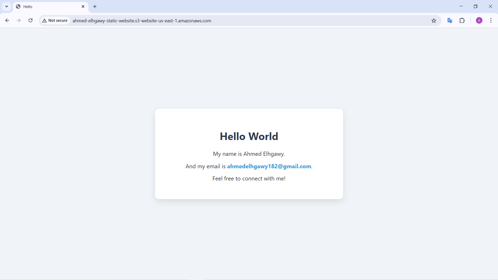
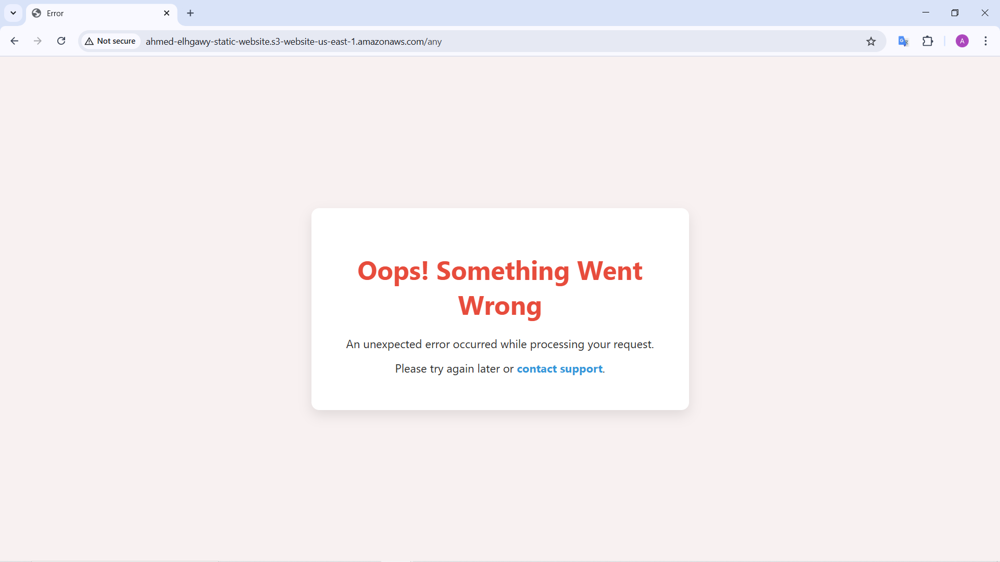

# AWS S3 Static Website Hosting with Terraform

This Terraform project provisions an **Amazon S3 bucket** configured for **static website hosting**, including:

- Public read access
- Website configuration (index and error pages)
- Optional versioning and ownership control
- Policy that allows global read access to site files

## 📸 Screenshots

### ✅ Deployed Static Website Example

| **Index**                        | **Error**                        |
| -------------------------------- | -------------------------------- |
|  |  |

## 📦 What It Does

- Creates an S3 bucket named 
- Configures it as a static website with `index.html` and `error.html`
- Allows public access to all objects in the bucket
- Adds ownership controls and disables versioning

## 🏗️ Architecture

```markdown
┌──────────────────────────────────────────┐
│ AWS S3 Bucket                            │
│                                          │
│ • index_document = index.html            │
│ • error_document = error.html            │
│ • Public read access (via bucket policy) │
└──────────────────────────────────────────┘
```

## 🚀 Getting Started

### Prerequisites

- [Terraform](https://www.terraform.io/downloads)
- AWS CLI configured with appropriate credentials (`aws configure`)

### 1. Clone the Repository

```bash
git clone https://github.com/manaro-projects/project-2.git
cd project-2
```

### 2. Configure Input Variables
Create a terraform.tfvars file or pass these values via CLI:

```hcl
region = "us-east-1"
buckt_name = "ahmed-elhgawy-static-website"
```
Replace us-east-1 with your preferred AWS region.

### 3. Initialize and Apply Terraform
```bash
terraform init
terraform apply
```

## 🌐 Accessing the Website
Once deployed, you can access your static website via the S3 website endpoint:

```plaintext
http://<bucket-name>.s3-website-<region>.amazonaws.com
```
For this project:

```plaintext
http://<bucket_name>-<region>.amazonaws.com
```
Replace <region> with your actual AWS region (e.g. us-east-1).

## 📄 Files You Need in the Bucket
To make your website functional, upload at minimum:
- index.html — your homepage
- error.html — page to show on errors (like 404)

You can upload them manually via AWS Console or automate with AWS CLI.

```bash
aws s3 cp index.html s3://<bucket_name>/
aws s3 cp error.html s3://<bucket_name>/
```

## 🛠 Resources Created
| Resource Type	| Name / Purpose |
|---------------|----------------|
| aws_s3_bucket	| Primary static website bucket |
| aws_s3_bucket_versioning	| Versioning config (disabled) |
| aws_s3_bucket_ownership_controls	| Enforces bucket ownership |
| aws_s3_bucket_public_access_block	| Allows public access |
| aws_s3_bucket_website_configuration	| Sets index.html and error.html |
| aws_s3_bucket_policy | Grants s3:GetObject to everyone |

## 📝 Notes
Versioning is currently disabled. You can change this to Enabled in the Terraform code.

Make sure that the bucket name is globally unique.

## 📧 Contact
Built with ❤️ by Ahmed Elhgawy
Feel free to reach out at: ahmedelhgawy182@gmail.com
